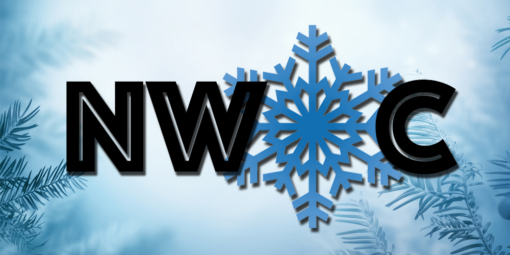
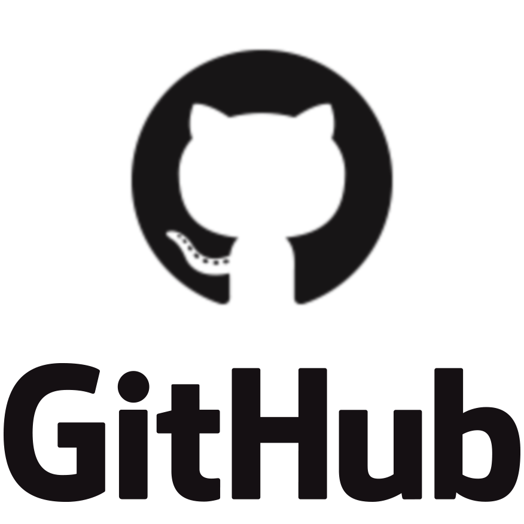
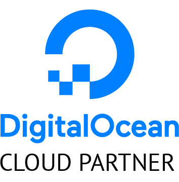

<h1> NWoC - NJACK Winter of Code</h1>

<h2>About Us</h2>

NJACK Winter of Code is an initiative by NJACK, IIT Patna, targeted at students who have never participated in <b>Free or Open Source Software (FOSS)</b> development before, as well as at those who have already become an expert in Open Source Development and are currently contributing to projects of any domain, say Web, Mobile, Machine Learning, Blockchain, IoT etc. It also aims to prepare them for bigger programs and opportunities like Google Summer of Code, Outreachy etc.

<h2>Workflow</h2>

Participants can apply for the program either as a student or as a mentor. Mentors are selected through a selection process. The selected mentors propose projects, the best of which are chosen to be included in the program. Students work on these projects in their winter vacations. The mentors review the pull requests and the overall work on their project by various contributors throughout the coding period of the program. At the end of the coding period, the students are compared on the basis of most contributions.

<h2>Projects</h2>

NWoC 2019 had over 40 projects to work upon. We had projects ranging from Web, App Development to Blockchain and Machine Learning. For the complete list of projects in NWoC 2019, please visit the <a href="/projects.html">Projects</a> page.

<h2>NWoC is sponsored by</h2>

<h2>Previous edition sponsored by</h2>
&nbsp;&nbsp;
&nbsp;&nbsp;

<h2>Social Media Handles</h2>
<ul>
    <li><a href="mailto:njack@iitp.ac.in?subject=[NWoC]" target="_blank">njack@iitp.ac.in</i></a></li>
    <li><a href="mailto:njack.iitp@gmail.com?subject=[NWoC]" target="_blank">njack.iitp@gmail.com</a></li>
    <li><a href="https://www.facebook.com/njack.iitp/" target="_blank">Facebook</a></li>
    <li><a href="https://twitter.com/njackiitp" target="_blank">Twitter</a></li>
    <li><a href="https://github.com/Njack-IITP/" target="_blank">GitHub</a></li>
</ul>

Visit our website <a href="https://njackwinterofcode.github.io/">here</a> .
